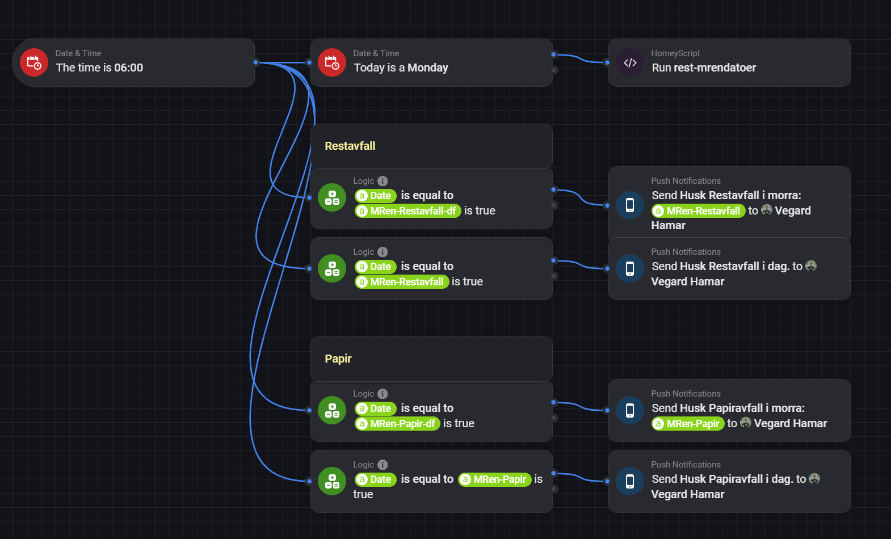
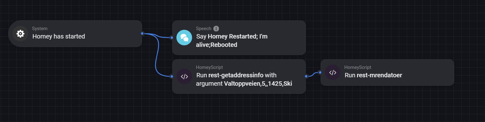

# HomeyPro

This is where I play around with Homey Pro and share what I make. If the info below is Norwegian then it's so because the script/Flow info is Norway specific.

## **Scripts**
### [**Hent Addresse Info**](./wiki/rest-getaddressinfo.md)
Dette HomeyScript'et henter adresse info fra Kartverket og lagrer informasjonen som tag'er. 
### [**Min Renovasjon**](./wiki/rest-mrendatoer.md)
Dette HomeyScript'et henter tømmedatoer for forskjellige typer avfall fra Min Renovasjon og lagrer tømmedatoene i tag'er.
### **Yr.no Forecast** [rest-getyrweather.js](Scripts/rest-getyrweather.js) & [rest-getyrweather24.js](Scripts/rest-getyrweather24.js)
Siden jeg allerede hadde hjemmo lokasjon fra Adresse Info scriptet så tenkte jeg at jeg kunne hente litt værmelding også fra Yr.no. Kan brukes uten addresse info så sant du enten lager to tag'er (adr-lat og adr-lon) eller forandrer de 2 første linjene. Værvarsel lagres henholdsvis i tag'ene **yrnestetime** og **yrneste24**
### **Get TibberPrices** [get-tibberprices.js](Scripts/get-tibberprices.js)
A quick hack for getting the cheapest hour and cheapest 3h period from Tibber API. Fetches and calculates for today, and for tomorrow if data is available (run script after 13:00)
## **Flows**
### Min Renovasjon
Eksempel på bruk av Min Renovasjon scriptet ovenfor. 
* Hver mandag 06:00, hent tømmedatoer.
* Hver dag sjekk om det er tømming i dag eller i morra og send notifikasjon om det er.
  

### Homey Restarted
This is a flow that runs every time the Homey restart, running script that set's tags that are used in other flows.

